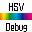

# [ TextureWorker](https://pmzeroskyline.github.io/TextureWorker/)

## 

### [*一款免费的轻量级批量图片属性修改器*](https://pmzeroskyline.github.io/TextureWorker/)

# [ ReNamer](https://pmzeroskyline.github.io/ReNamer/)

## 

### [*一款免费的轻量级批量文件命名修改器* ](https://pmzeroskyline.github.io/ReNamer/)

# [ HSVDebug(UE4插件)](https://pmzeroskyline.github.io/HSVDebugWidget/)

## 

### [*一款免费UE4插件 新增编辑器窗口 实时预览选定相机的HSV画面* ](https://pmzeroskyline.github.io/HSVDebugWidget/)

# [ FishBrust](https://pmzeroskyline.github.io/FishBrust/)

## 

### [*可以发送邮件 把多个附件 拆分成多个邮件 自动批量发送的软件* ](https://pmzeroskyline.github.io/FishBrust/)

> 由 [guzhang0@gamil.com](https://github.com/PMZeroSkyline) 提供支持 欢迎错误反馈
